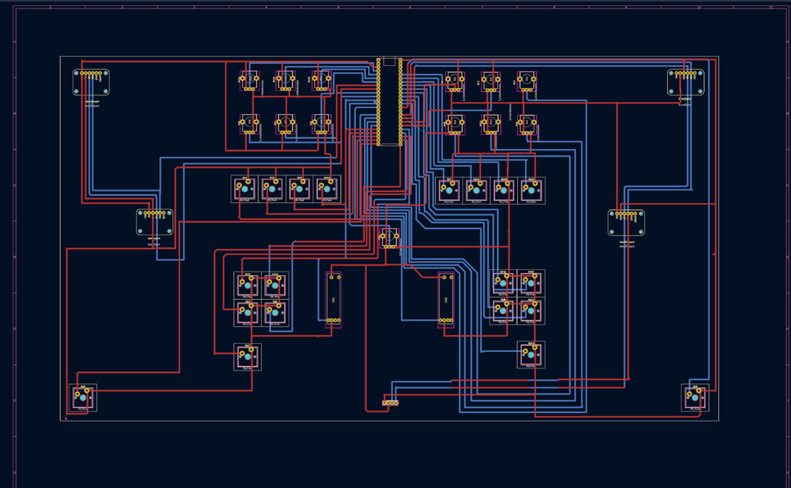
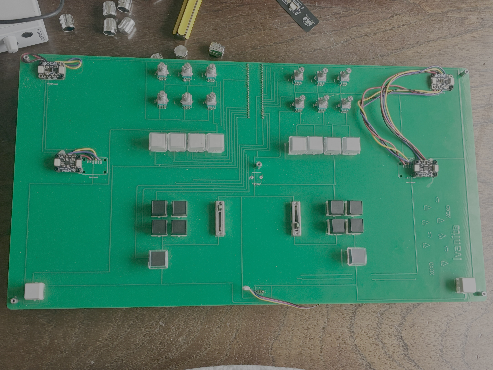

# DIY DJ Controller

A custom-built DIY DJ controller combining sensor-based hardware, embedded systems, and open-source DJ software to explore expressive and physical approaches to digital DJ performance.

This project was developed initially as part of a music technology course and later expanded into a master’s thesis, focusing on hands-on instrument design, physical interaction, ethical AI use, and creative authorship.

🎥 Video demo:  
https://youtu.be/EEeUhQ8b_II

---

## Overview

This repository documents the design and implementation of a two-deck DJ controller built from scratch. The system uses magnetic angle, distance, and touch sensors to translate physical gestures into musical control. The controller is designed as an alternative to closed, commercial DJ gear, emphasizing expressivity, transparency, and user agency.

---

## Project Goals

- Design a fully functional DJ controller using custom hardware  
- Explore sensor-based interaction beyond traditional knobs and faders  
- Map physical gesture to meaningful musical control  
- Use open-source software and tools where possible  

---

## Repository Structure

- `arduino/` — Arduino / Teensy firmware  
- `mixxx/` — Mixxx XML and JS mapping files  
- `hardware/` — PCB designs and hardware documentation  
- `media/` — Photos of the controller and components  

## Hardware

- Teensy microcontroller  
- 2 × AS5600 magnetic angle sensors (jog wheels)  
- 2 × VL53L0X time-of-flight sensors (tempo control)  
- 1 × Trill Touch Bar (crossfader)  
- 20 buttons  
- 12 knobs (6 per deck)  
- 2 sliders  
- Custom PCB  
- Laser-cut enclosure made from recycled PLA  
- 3D-printed DJ platters mounted on **Lazy Susan bearing hardware**

  
   
  <em>Controller schematic.</em>

  
   
  <em>KiCad PCB layout view showing component placement and routing.</em>

  
   
  <em>Custom PCB used for sensor and control integration.</em>

---

## Software

- Mixxx (open-source DJ software)  
- Custom Arduino firmware  
- Mixxx MIDI mappings:
  - `.xml` files generated and refined using the Mixxx Learning Wizard  
  - `.js` scripts manually edited for jog wheel and scratching behavior  

---

## Controls & Interaction

Most controls were mapped using **Mixxx’s Learning Wizard**, which allows direct assignment of buttons, knobs, and sliders to software parameters. Jog wheels required additional manual configuration through Mixxx’s XML and JavaScript mapping system.

### Jog Wheels

- AS5600 magnetic angle sensors control the DJ platters  
- Enable track nudging and scratching behavior  
- Each 3D-printed DJ platter is **glued to Lazy Susan bearing hardware**, allowing smooth mechanical rotation above the sensor  

  
   
  <em>3D-printed DJ platter with embedded magnet mounted on Lazy Susan hardware.</em>

### Tempo Control

- VL53L0X time-of-flight sensors  
- Tempo is controlled by hand distance above the sensor  

### Channel Volume

- Slider controls channel volume for each deck  

### Equalization (3 Knobs per Deck)

- Knob 1 → High EQ  
- Knob 2 → Mid EQ  
- Knob 3 → Low EQ  

### Effects (3 Knobs per Deck)

- Knob 4 → FX 1  
- Knob 5 → FX 2  
- Knob 6 → FX 3  

Effect types are configurable in Mixxx and can be reassigned without changing hardware.

### Performance Controls

- Buttons 1–4 → Hot Cues  

### Looping Controls

- Button 5 → Loop In  
- Button 6 → Loop Out  
- Button 7 → Reloop  
- Button 8 → Exit Loop  

### Transport Controls

- Button 9 → Beat Sync  
- Button 10 → Play / Pause  

### Crossfader

- Trill Touch Bar  
- Shared across both decks  
- Blends audio between Deck 1 and Deck 2  

---

## Build Notes & Lessons Learned

Several practical challenges emerged during development:

- Noisy potentiometers caused unstable MIDI output and were resolved using the `ResponsiveAnalogRead` library.  
- Jog wheels could not be fully configured using Mixxx’s Learning Wizard and required manual editing of `.xml` and `.js` files.  
- PCB footprint errors required last-minute manual wiring fixes.  
- Multiple I2C devices required careful bus management; the Trill Touch Bar library only supports the default I2C bus.  
- Laser cutting recycled PLA required extensive testing due to material thickness and behavior.  
- Jog wheel noise was traced to incorrect **vertical magnet distance**, rather than radial placement.

  
   
  <em>Laser-cut recycled PLA enclosure with Lazy Susan bearing used for platter rotation.</em>

---

## References & Documentation

Mixxx MIDI scripting (jog wheels and scratching):  
https://github.com/mixxxdj/mixxx/wiki/midi%20scripting#Scratching-and-jog-wheels  

Laser cutting PLA reference paper:  
https://isam2022.hemi-makers.org/wp-content/uploads/sites/3/2022/10/117..pdf  

PLA welding technique:  
https://all3dp.com/2/pla-welding-how-to-fuse-pla-seams-and-cracks/  

Mixxx DJ software:  
https://mixxx.org  

---

## Author

Ivana Rasch Chinchilla  
Music Technology, NYU  

